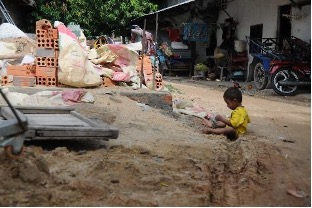
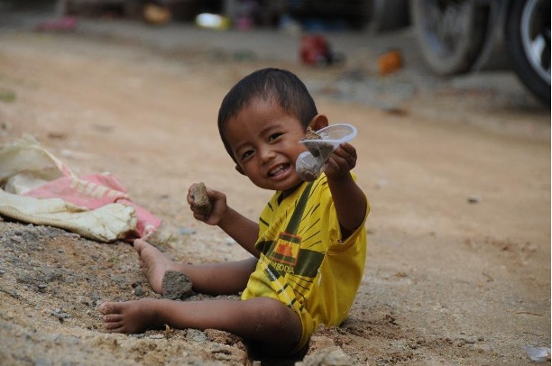
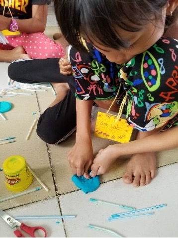

# 神給我配上一副新眼鏡

*黃錦健*

受洗時，我引用約翰福音十 10 下半段作為座右銘：「我來了，是要叫羊得生命，並且得的更豐盛。」那時的我並不完全明白什麼是「豐盛的生命」，直到 2016 年參與「基督豐榮團契」（FiCF）的服事。

2016 年與 2019 年，我們一家四口跟隨「豐榮」前往柬埔寨短宣。最初我以為是去幫助有需要的人，也想讓孩子們體驗艱苦環境。然而待了幾天後，我的觀念改變了。我看到一個男孩坐在露天垃圾堆旁，高興地用塑膠杯玩著泥。如果我是他，我大概會覺得自己非常貧窮與無助，討厭身邊垃圾的臭味，甚至抱怨神不公平，把我放在這麼貧困的地方！這個男孩給我上了第一課：無論身處多麼惡劣的環境，都應該學會數算恩典並知足。

 

後來我們為當地兒童舉辦聖經班，清理現場時，我注意到一個女孩細心地把卡在吸管裡的微小黏土擠出來，我連忙對她說：「丟掉沒關係的，不用辛苦把那一點點黏土擠出來。」她卻回答說：「我想留給其他人以後用，不想浪費。」她的回答令我很震撼，我以為自己是來教導她們的，事實上是她教導了我什麼是善用資源的好管家。

2019 年，我們很感恩能與「豐榮」創辦人之一劉秀嫻（Dora）牧師同行。Dora 牧師和 Uncle John 多年來一直是我們的屬靈導師，她常用路加福音四18–19 提醒我們去關懷廣大受壓制的婦女與女孩。在短宣結束後，Dora 牧師依然主動在我們日常生活的婚姻與子女教養衝突中給予指引、傾聽並給予建議。

我原以為自己是去展現憐憫，但一個人若沒有先被愛過，怎麼懂得去愛人？正是 Dora 牧師先愛了我們，我們才學會如何關心身邊的人。最近我陪伴一位正面臨婚姻難題的弟兄，將這份愛傳遞出去，心中充滿感恩。

透過這個事工，我真正明白了何謂豐盛的生命：

- 學會知足 — 時常數算上帝的恩典
- 作好管家 — 珍惜並善用神所託付的資源
- 學習去愛 — 像上帝愛我們一樣，主動愛身邊的人

我往柬埔寨並非單純去「幫助」人，反而是那裡的人教導了我如何活出豐盛的生命。
