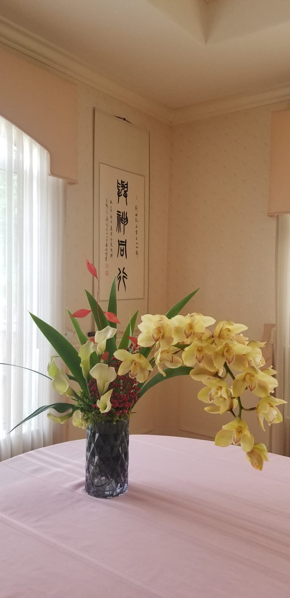

疫情初期，我曾送了一些物資到「豐榮中心」。當時，葉美珠（Mimi）牧師正在為中心的蘭花分盆，也順便送了我一盆。

帶回家後，我把它放在廚房窗外。每天看著它，總能感受到那份柔和卻堅韌的生命力。幾年過去，我也陸續將它分植成三盆；到了今年，更開出了十多枝花梗，一朵朵蘭花靜靜綻放。

雖然我從未學過插花，但蘭花本身的清雅與秀麗無需刻意裝飾，只要隨手插在花瓶裡，便自然流露出高貴而優雅的氣質。每年花開時，我都會將剪下的蘭花送給身邊的親友，邀請他們一同欣賞上主奇妙的創造，也一同分享這份美好的祝福。

回想當年領受的那一盆蘭花，如今竟年年開花，不斷繁衍，成為許多人的祝福。適逢「豐榮」成立二十五週年，我不禁想到，「豐榮」多年來不也是如此默默耕耘、耐心栽培生命嗎？

一粒種子、一盆蘭花，看似微不足道，卻在歲月中悄然成長、繁衍，結出豐盛的果實。許多人因著「豐榮」的陪伴與培育，生命得著更新，也將所領受的愛與恩典繼續傳遞出去，成為更多人的祝福。

感謝主，二十五年來，祂藉著「豐榮」忠心的服事，在無數生命中成就了如此美好的工作。願祂繼續使用「豐榮」，使更多生命在基督裡扎根、成長，並結出纍纍的果子，榮耀祂的名。

